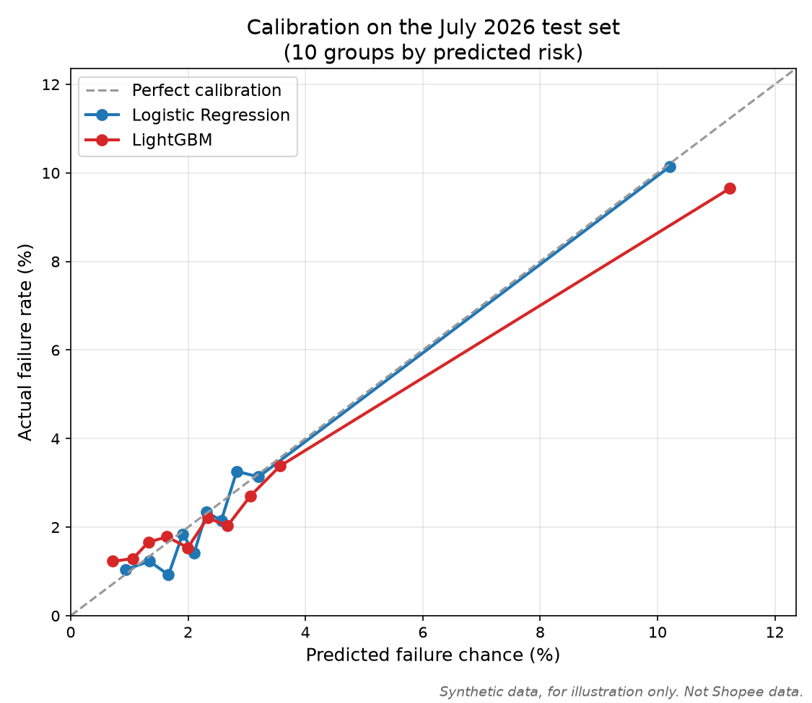
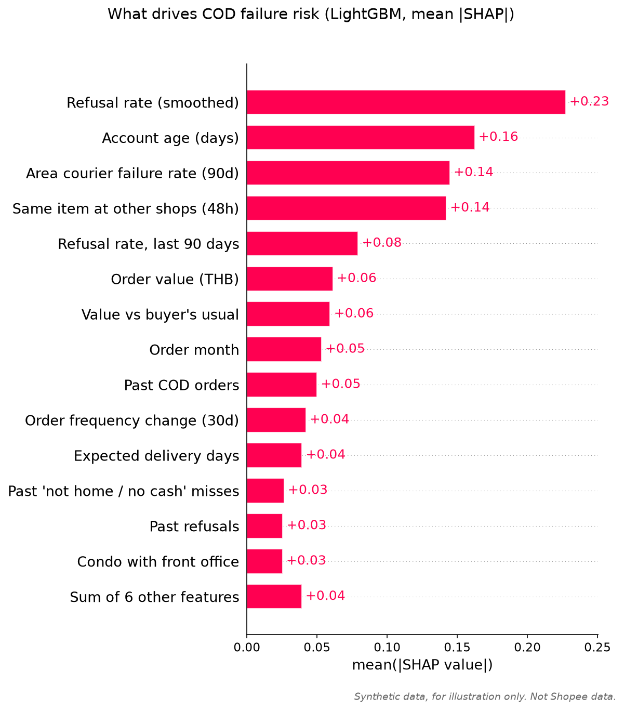
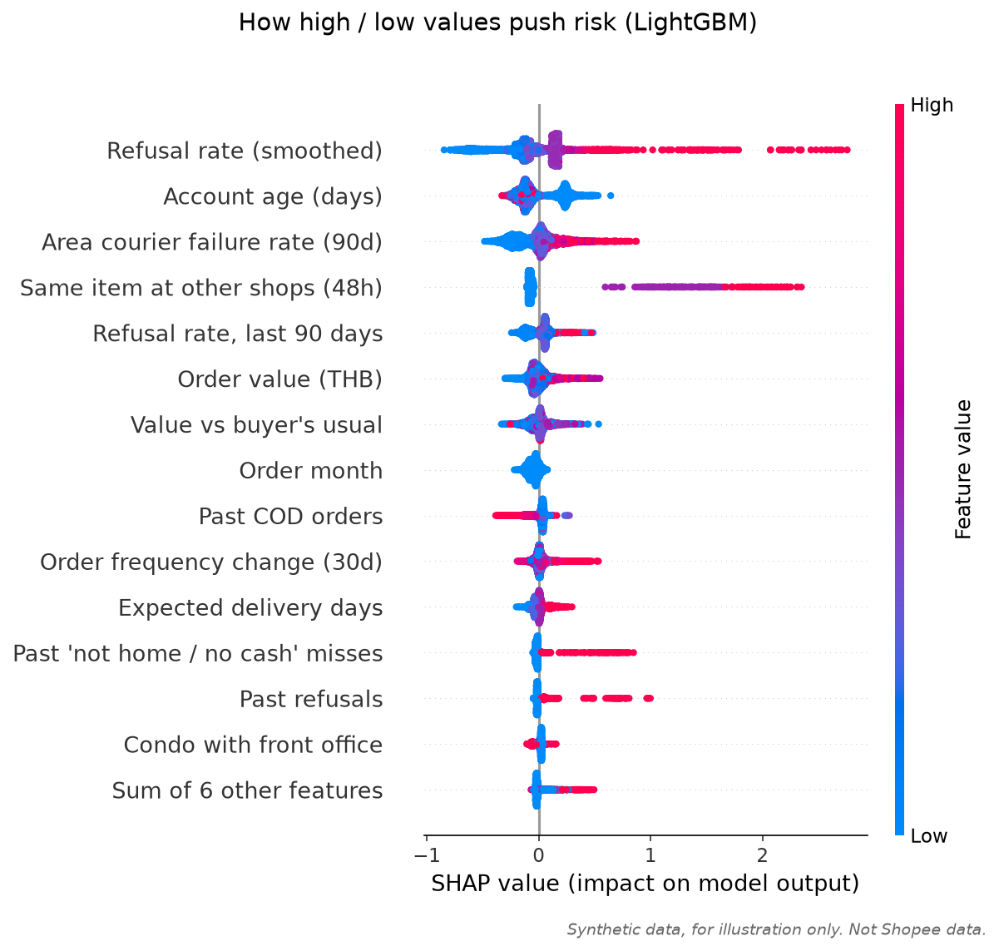
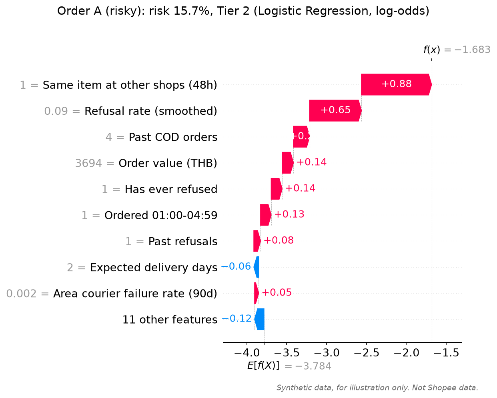
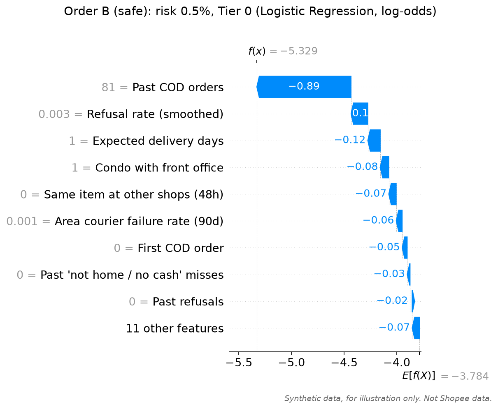

# COD Risk Score: model report

> SYNTHETIC DATA - for illustration only. This is NOT real Shopee data. Generated by the cod_risk_demo pipeline for a case competition demo.

**These results show how the system works on synthetic data. Real accuracy will be measured in the pilot with Shopee data.**

Test set: 16,263 COD orders from July 2026, 447 failures (2.75%). The test set was used only for this final evaluation.

## Setup

- Features: the 20 columns marked `feature` in `docs/data_dictionary.md`. A code check stops training if any leakage, hidden or id column gets in.
- Training: Feb 2026 to early Jun 2026 (47,975 orders). Validation: the last 20% of the train period by date (11,994 orders, from 2026-06-04), used for early stopping, choosing LightGBM settings and calibration.
- Baseline: Logistic Regression (scaled features, balanced class weights).
- Main: LightGBM. Tried the base settings plus 3 small changes; picked `{'num_leaves': 15}` by validation AUC:

| LightGBM setting | Trees (early stopping) | Validation AUC |
| --- | --- | --- |
| `base` | 94 | 0.7037 |
| `{'num_leaves': 15}` | 185 | 0.7106 |
| `{'min_child_samples': 300}` | 108 | 0.7048 |
| `{'num_leaves': 15, 'min_child_samples': 300, 'learning_rate': 0.02}` | 193 | 0.7095 |
| *Logistic Regression, for reference* | | 0.7146 |

- Calibration: both models, `platt` method, fitted on the validation set.

## Results on the test set

| Metric | Logistic Regression | LightGBM |
| --- | --- | --- |
| AUC | 0.715 | 0.692 |
| **Top 30% capture** (target >= 60%) | **60.2%** | **57.3%** |
| Top 5% capture | 29.8% | 29.5% |
| Actual failure rate inside the top 5% | 16.4% (6.0x average) | 16.2% (5.9x average) |
| Brier score (lower is better) | 0.02510 | 0.02527 |
| *Brier score if we always predicted the average rate* | 0.02673 | |
| New COD buyers only: AUC | 0.592 | 0.566 |
| New COD buyers only: top 30% capture (ranked among new buyers) | 41.9% | 38.7% |
| New COD buyers' failures caught in the overall top 30% | 81.5% | 63.7% |
| `wont` failures caught in the top 30% | 72.4% | 71.4% |
| `cant` failures caught in the top 30% | 36.5% | 30.2% |
| `logistics` failures caught in the top 30% | 33.3% | 25.0% |
| Mix of the failures caught in the top 30% (wont / cant / logistics) | 79.9% / 17.1% / 3.0% | 82.8% / 14.8% / 2.3% |

New COD buyers are 23.0% of test orders and have no refusal history at all, yet the model still ranks them using order-context signals.

## Recommended model

**Logistic Regression.** LightGBM's AUC gap over Logistic Regression is -0.023 (under 0.01). It does not clearly win, so the simpler, easier-to-explain Logistic Regression is recommended.

The decision tiers and the demo use the recommended model's calibrated score.

## Calibration (test set)

Orders are split into 10 equal groups by predicted risk. A trustworthy % means predicted and actual are close.

| Group | Orders | LR predicted | LR actual | LightGBM predicted | LightGBM actual |
| --- | --- | --- | --- | --- | --- |
| 1 | 1,627 | 0.94% | 1.04% | 0.72% | 1.23% |
| 2 | 1,626 | 1.34% | 1.23% | 1.06% | 1.29% |
| 3 | 1,626 | 1.67% | 0.92% | 1.32% | 1.66% |
| 4 | 1,626 | 1.91% | 1.85% | 1.64% | 1.78% |
| 5 | 1,627 | 2.10% | 1.41% | 2.00% | 1.54% |
| 6 | 1,626 | 2.31% | 2.34% | 2.33% | 2.21% |
| 7 | 1,626 | 2.57% | 2.15% | 2.67% | 2.03% |
| 8 | 1,626 | 2.83% | 3.26% | 3.06% | 2.71% |
| 9 | 1,626 | 3.20% | 3.14% | 3.57% | 3.38% |
| 10 | 1,627 | 10.21% | 10.14% | 11.23% | 9.65% |

Each group has about 1,600 orders and only 10 to 150 failures, so small gaps between predicted and actual are expected noise.

## Explanations (SHAP)

Overall charts: LightGBM + `shap.TreeExplainer` on 5,000 test orders. The two example orders use the recommended model (Logistic Regression), so they match the demo scores.

### Top 10 factors vs the hidden rule

"Found?" = the factor is in the top 10 and pushes risk in the same direction as the hidden rule (direction = sign of the correlation between the value and its SHAP value).

| LightGBM rank | Factor | Mean abs SHAP | Learned direction | LR rank | True effect in the hidden rule | Found? |
| --- | --- | --- | --- | --- | --- | --- |
| 1 | Refusal rate (smoothed) | 0.227 | higher = riskier | 3 | Evidence of the hidden refusal trait `latent_wont` (the main driver) | yes |
| 2 | Account age (days) | 0.162 | higher = safer | 11 | +0.6 if the account is younger than 30 days; recent signups have more high-refusal buyers | yes |
| 3 | Area courier failure rate (90d) | 0.145 | higher = riskier | 5 | Evidence of the area's hidden courier failure rate | yes |
| 4 | Same item at other shops (48h) | 0.142 | higher = riskier | 2 | +1.0 log-odds per shop (max 2); also more common for high-refusal buyers | yes |
| 5 | Refusal rate, last 90 days | 0.079 | higher = riskier | 19 | Evidence of `latent_wont`, incl. drift in the last 90 days | yes |
| 6 | Order value (THB) | 0.061 | higher = riskier | 15 | No direct effect (only the value vs usual matters) | no direct effect; picked up as a proxy |
| 7 | Value vs buyer's usual | 0.059 | higher = riskier | 20 | +0.35 at 2-3x, +0.7 at 3x+ the buyer's TRUE usual value | yes |
| 8 | Order month | 0.053 | flat | 18 | +0.5 (can't) in April and late December. All test orders are July, so here it is only a constant shift | no direct effect; picked up as a proxy |
| 9 | Past COD orders | 0.050 | higher = safer | 1 | No direct effect: exposure only (but long-time buyers are less often in the high-refusal group) | no direct effect; picked up as a proxy |
| 10 | Order frequency change (30d) | 0.042 | higher = riskier | 14 | +0.4 if >= 3 | yes |

The model found 7 of the true drivers in its top 10 with the right direction. True drivers outside the top 10: Past refusals, Has ever refused, Past 'not home / no cash' misses, Ordered 01:00-04:59, Campaign day, Expected delivery days, Condo with front office. These are either rare (late-night orders are 8% of orders, frequency spikes under 1%) or affect only the smaller `cant` / `logistics` failure types, so their total contribution is small.

### Expected order

Expected: refusal history > recent refusal rate > days since last refusal > order factors > area and courier factors.

| Group | Best LightGBM rank | Best LR rank |
| --- | --- | --- |
| Refusal history | 1 | 3 |
| Recent refusal rate | 5 | 19 |
| Days since last refusal | 15 | 16 |
| Order factors | 2 | 2 |
| Area and courier factors | 3 | 5 |

The groups are **not exactly** in the expected order. Refusal history is on top as expected. The recent rate and days since last refusal carry mostly the same information as the lifetime refusal rate, so the model gives the credit to one of them and the others rank lower. Order factors, especially the same item at other shops, are stronger than the brief expected because about a quarter of orders come from buyers with no history, where order factors are the only signal.

### Example orders

- **Order A (risky)**: risk 15.7%, Tier 2 (Confirm + choose prepaid, deposit or call). Top reasons: Same item ordered with COD at 1 other shop in 48h (raises risk); Refused 1 of 4 past COD parcels (raises risk); Only 4 past COD orders (little track record) (raises risk)
- **Order B (safe)**: risk 0.5%, Tier 0 (Nothing extra). Top reasons: 81 past COD orders (long track record) (lowers risk); Refused 0 of 81 past COD parcels (lowers risk); Delivery expected in 1 day (lowers risk)
